[한국어](./README.md) | **English**

# AI Activity Portfolio

**Jinwoo Park (박진우)** · Korea Digital Media High School · [goodpjw2008@gmail.com](mailto:goodpjw2008@gmail.com)

---

# 1. Research Reports

### ① Safety Evaluation of Large Language Models on Korean Neologisms and Slang
- Not public because it names specific models. Please contact me by email if you would like a copy.

### ② Identifying, Correcting, and Improving the Performance of an Equilateral Triangle Partition Enumeration Algorithm
- **Research report (Korean)** — [정삼각형_분할_열거_알고리즘의_오류_규명_정정과_성능_개선에_대한_연구.pdf](./paper/정삼각형_분할_열거_알고리즘의_오류_규명_정정과_성능_개선에_대한_연구.pdf)

### ③ Building a Chess Evaluation Function for Low-Spec Environments: Implementing and Validating a PST/NNUE Hybrid
- Not public because the report has not been presented yet. Please contact me by email if you would like a copy.

---

# 2. Projects

### ① AI Safe Driving Level-Up — Right Turns and School Zone Full Stops
- **Overview** — An AI-assisted service that helps drivers level up toward safe-driving mastery. This edition focuses on the two rules drivers find most confusing and hardest to keep: right turns, and full stops at unsignalized crosswalks in school zones.
- **Repository** — [https://github.com/goodpjw2008/Project_AI-SafeDriveLevelup](https://github.com/goodpjw2008/Project_AI-SafeDriveLevelup)
- **Service** — [https://safedrive.ai.kr](https://safedrive.ai.kr)
- **QR code** — Scan with your phone camera to start practicing right away, no installation needed

  

### ② Building a Chess Evaluation Function for Low-Spec Environments: Implementing and Validating a PST/NNUE Hybrid
- **Overview** — Implemented a hybrid evaluation function that blends PST with a self-trained NNUE at ratio r, and verified through self-play and live games on lichess that it is the best configuration for low-spec environments
   Packaged as a single executable that runs without internet or installation, and distributed for Windows, Linux, and macOS
- **Repository** — [https://github.com/goodpjw2008/Project_AI-ChessBot-Hybrid](https://github.com/goodpjw2008/Project_AI-ChessBot-Hybrid)
- **Download "Chess for Everyone"** — [Windows (x64)](https://github.com/goodpjw2008/goodpjw2008/raw/main/download/allchess-windows-x64.zip) · [Linux (x64)](https://github.com/goodpjw2008/goodpjw2008/raw/main/download/allchess-linux-x64.tar.gz) · [Linux (ARM64)](https://github.com/goodpjw2008/goodpjw2008/raw/main/download/allchess-linux-aarch64.tar.gz) · [macOS (Intel · Apple Silicon)](https://github.com/goodpjw2008/goodpjw2008/raw/main/download/allchess-macos.tar.gz)

### ③ Exploring AI and Algorithms for Chess (Improving Search Algorithms and the PST Model)
- **Overview** — Improved heuristic algorithms for a chess AI, including BFS, Minimax, and α-β pruning, improved the PST evaluation model, and compared performance
- **Repository** — [https://github.com/goodpjw2008/Project_AI-ChessBot-PST](https://github.com/goodpjw2008/Project_AI-ChessBot-PST)

### ④ Building Two AI Bots and Reaching Top Ranks on an International Platform
- **Overview** — With two self-designed AI bots on CodinGame, a global AI and coding bot competition platform, ranked #1 in Korea and in the global top 0.2%, reaching Legend tier in both the AI and Coding Speed categories
- **Project report (Korean)** — [AI_봇_2종_구현_및_국제_플랫폼_최상위권_성적_달성.pdf](./projects/AI_봇_2종_구현_및_국제_플랫폼_최상위권_성적_달성.pdf)
- **Repository** — [https://github.com/goodpjw2008/Project_AI-Bots-CodinGame](https://github.com/goodpjw2008/Project_AI-Bots-CodinGame)

### ⑤ Kaggle Competition Results (as of Oct 6, 2026)
- [Kaggle profile (goodpjw2008)](https://www.kaggle.com/goodpjw2008) — Notebooks Expert, 685/60,286 (top 1.1%), 1 silver · 7 bronze medals

  

$\color{#0969da}{\textsf{View evidence}}$

  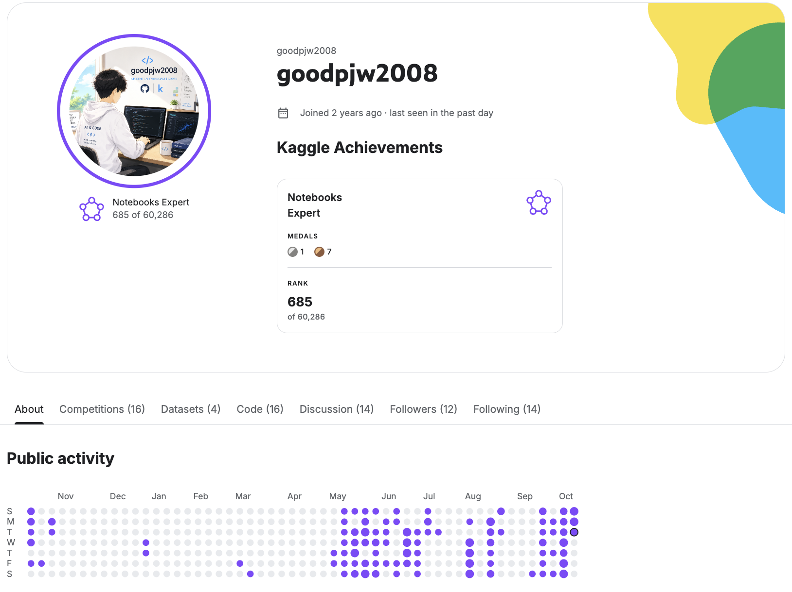

  

- Major competition results

  | Competition | Overview | Rank | Top | Medal | Status |
  |---|---|:---:|:---:|:---:|:---:|
  | [Kaggriculture](https://www.kaggle.com/competitions/kaggriculture) | Featured Simulation Competition; AI agents compete to maximize income in a farming simulation | 507/10246 | 4.9% | Silver | Ongoing |
  | [RSNA Knee Abnormality Detection](https://www.kaggle.com/competitions/rsna-knee-abnormality-detection) | Research Code Competition; a model that detects knee abnormalities from multimodal imaging data | 347/5168 | 6.7% | Bronze | Ongoing |
  | [Predicting Electric Vehicle Purchases](https://www.kaggle.com/competitions/playground-series-s6e9) | Playground Series Season 6 Episode 9; predicting whether a customer buys an electric vehicle | 21/3575 | 0.6% | - | Ended |
  | [Predicting F1 Pit Stops](https://www.kaggle.com/competitions/playground-series-s6e5) | Playground Series Season 6 Episode 5; predicting the number of pit stops in F1 Grands Prix | 222/3022 | 7.3% | - | Ended |
  | [KOAI 2026 National Team Selection P1](https://www.kaggle.com/competitions/koai-2026-p-1) | Korea AI Olympiad national team selection; predicting subscription service churn | 2/11 | - | - | Ended |
  | [KOAI 2026 National Team Selection P4](https://www.kaggle.com/competitions/koai-2026-p-4) | Korea AI Olympiad national team selection; predicting loan default risk | 5/11 | - | - | Ended |

  

$\color{#0969da}{\textsf{View evidence}}$

  **Kaggriculture**

  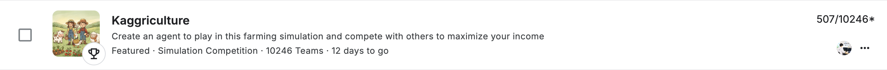

  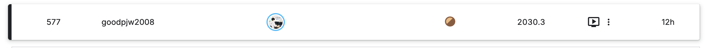

  **RSNA Knee Abnormality Detection**

  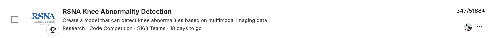

  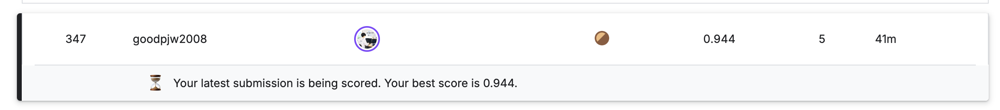

  **Predicting Electric Vehicle Purchases**

  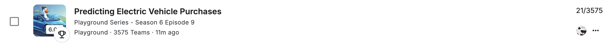

  **Predicting F1 Pit Stops**

  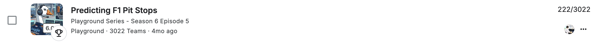

  **KOAI 2026 National Team Selection P1**

  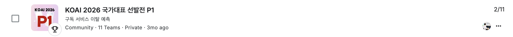

  **KOAI 2026 National Team Selection P4**

  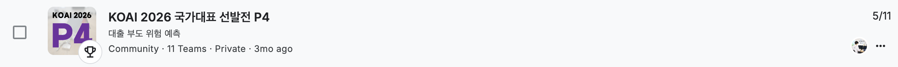

  

### ⑥ An Online Coding Learning Platform with an AI Coding Tutor
- **Overview** — Developed an online judge (OJ) learning platform for middle and high school students, supported by a generative AI coding tutor
- **Project report (Korean)** — [AI_코딩_선생님과_함께하는_온라인_코딩_학습_플랫폼_구현.pdf](./projects/AI_코딩_선생님과_함께하는_온라인_코딩_학습_플랫폼_구현.pdf)
- **Repository** — [https://github.com/goodpjw2008/Project_AI-DimiOJ](https://github.com/goodpjw2008/Project_AI-DimiOJ)
---

# 3. Awards

### ① 2026 — 3rd International Olympiad in Artificial Intelligence (IOAI): Individual Bronze Medal · 9th in Team Challenge
- International Olympiad in Artificial Intelligence (Aug 2–8, 2026, Astana, Kazakhstan); bronze medal in the individual contest, Korean delegation 9th in the team challenge

$\color{#0969da}{\textsf{View evidence}}$

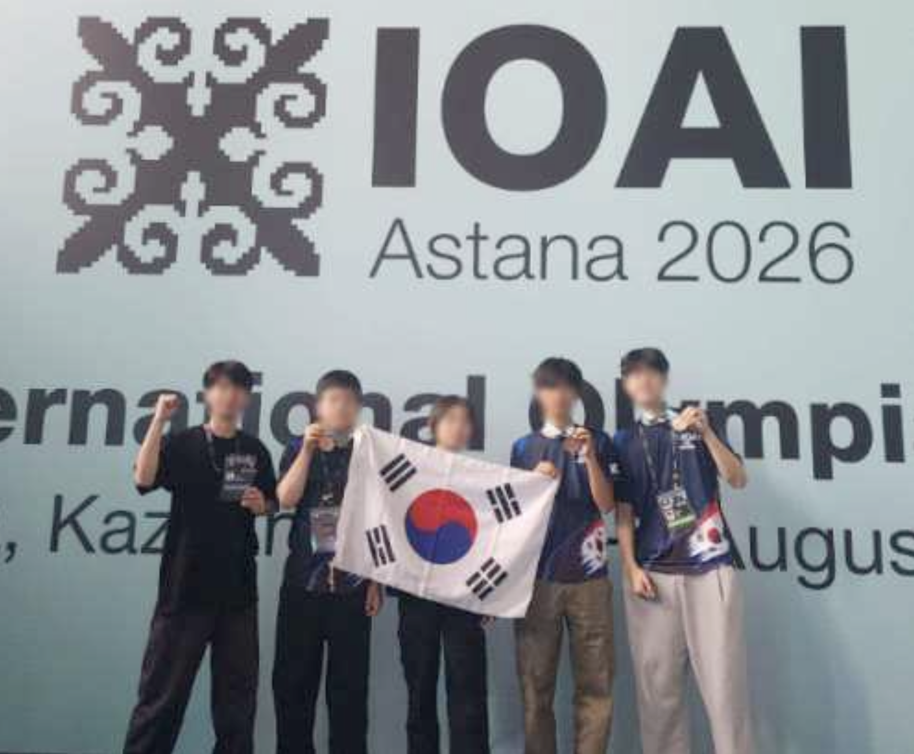

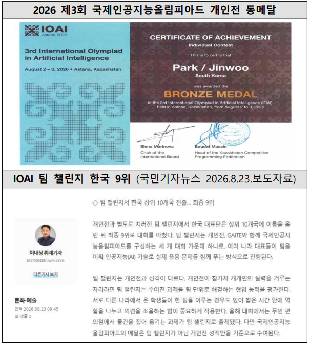

### ② 2026 — Selected for the Korean National Team, 3rd International Olympiad in Artificial Intelligence (IOAI)
- Recognized as a member of the Korean national team for the 3rd IOAI (Korea AI Olympiad Organizing Committee)

$\color{#0969da}{\textsf{View evidence}}$

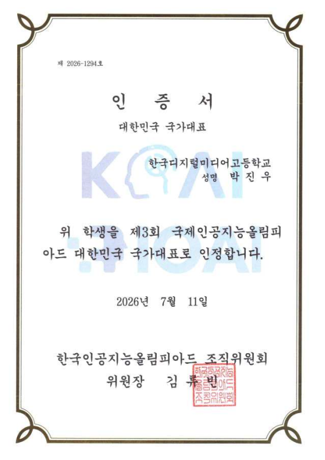

### ③ 2026 — Korea AI Olympiad (KOAI) Silver Award
- Korea AI Olympiad 2026, High School Division, Silver Award (Korea AI Olympiad Organizing Committee)

$\color{#0969da}{\textsf{View evidence}}$

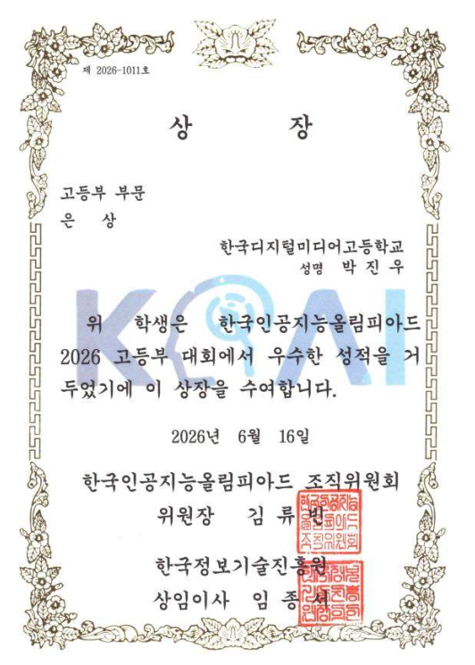

### ④ 2026 — NYPC Final Round Silver (3rd Place)
- 2026 NEXON YOUNG PROGRAMMERS CUP Rookie Track Final Round, Silver (3rd place); hosted by NEXON Korea and NEXON Foundation

$\color{#0969da}{\textsf{View evidence}}$

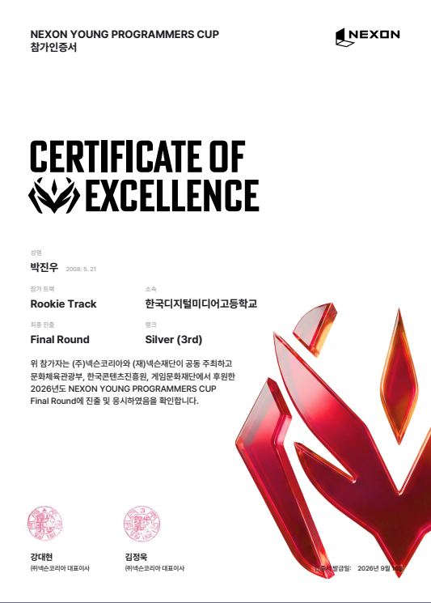

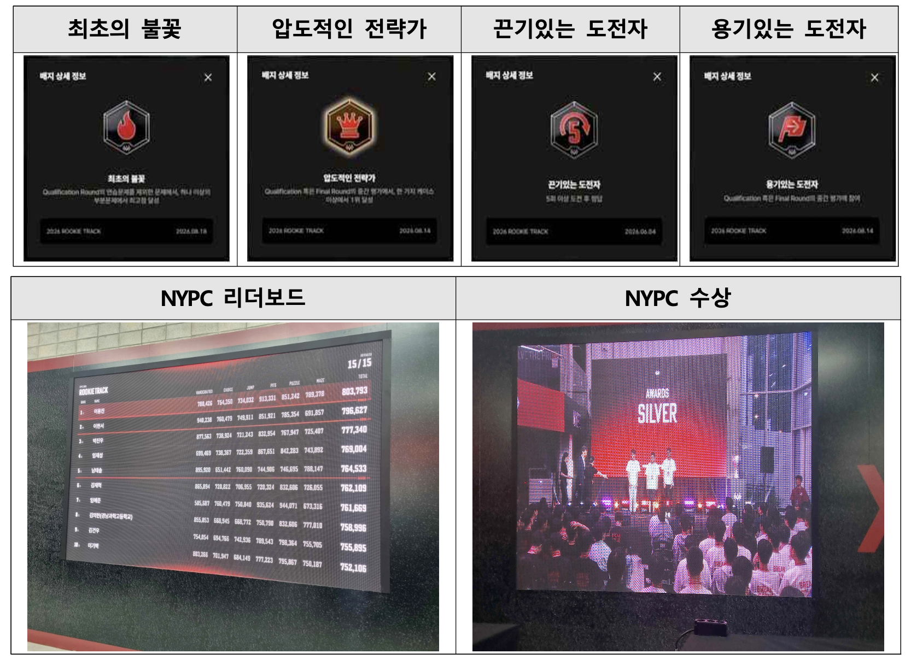

### ⑤ 2026 — 7th Youth IT Contest, Artificial Intelligence Division Gold Award (3rd Place)
- 2026 7th Youth IT Contest, Artificial Intelligence Youth Division, Gold Award; hosted by the Korea Information Technology Promotion Agency

$\color{#0969da}{\textsf{View evidence}}$

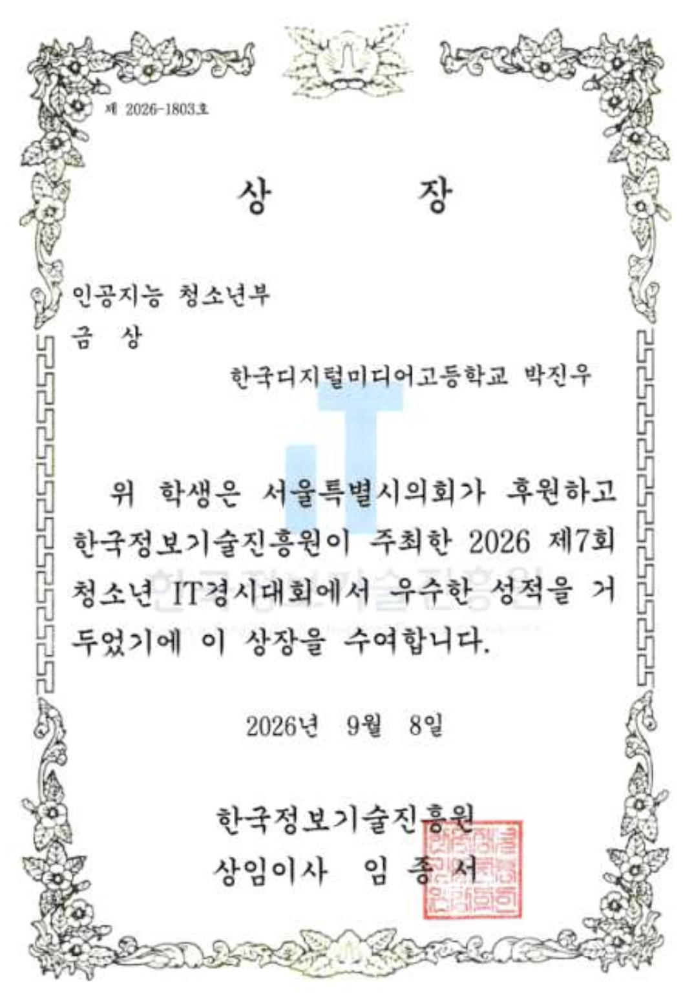

### ⑥ 2026 — Asia-Pacific Informatics Olympiad (APIO) (7th in Korea)
- 7th in Korea, 95th internationally; Asia-Pacific regional algorithm competition

$\color{#0969da}{\textsf{View evidence}}$

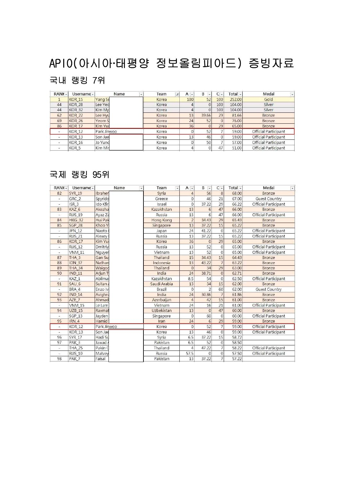

### ⑦ 2026 — Youth IT Contest, Algorithm High School Division Gold Award (3rd Place, Korea Information Technology Promotion Agency)
- 6th Youth IT Contest (Algorithm, High School Division); evaluates algorithm design and implementation skills

$\color{#0969da}{\textsf{View evidence}}$

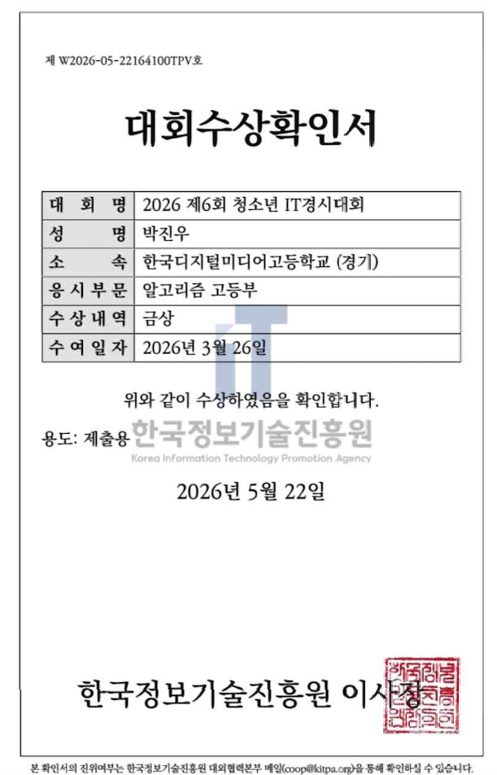

### ⑧ 2025 — K-EDU Creativity Competition Grand Prize (1st Place, Minister of Science and ICT)
- Carried out a creative AI/SW-based problem-solving project, from idea planning to implementation, applying computational thinking and problem solving

$\color{#0969da}{\textsf{View evidence}}$

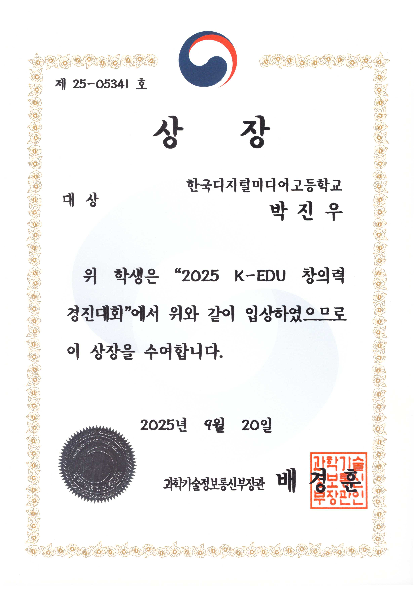

### ⑨ 2025 — Youth IT Contest, Algorithm High School Division Gold Award (3rd Place, Korea Information Technology Promotion Agency)
- 4th Youth IT Contest (Algorithm, High School Division); evaluates algorithm design and implementation skills

$\color{#0969da}{\textsf{View evidence}}$

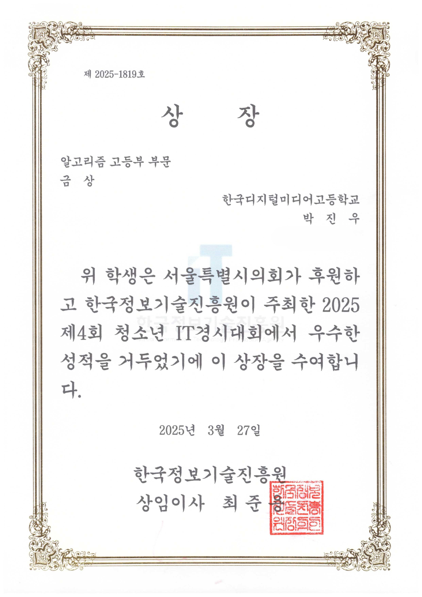

### ⑩ 2025 — Korea Olympiad in Informatics (KOI) Round 2, High School Division (Silver, Chair of the Informatics Olympiad Committee)
- 42nd KOI Round 2; problem solving with data structures and various algorithms, including time complexity optimization

$\color{#0969da}{\textsf{View evidence}}$

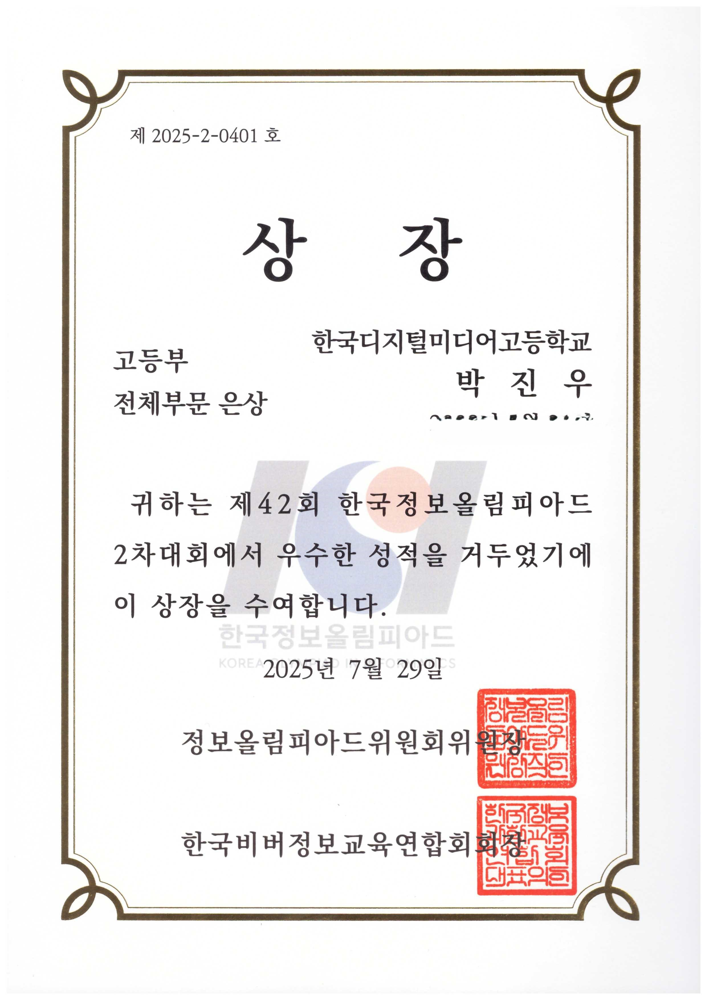

### ⑪ 2025 — ICT Award Korea, Discrete Mathematics High School Division (Silver, 3rd Place, President of the Korea Information Processing Society)
- 22nd ICT Award Korea (Discrete Mathematics, High School Division); problem solving based on discrete mathematics and logical reasoning, using mathematical modeling, computational thinking, and algorithmic approaches

$\color{#0969da}{\textsf{View evidence}}$

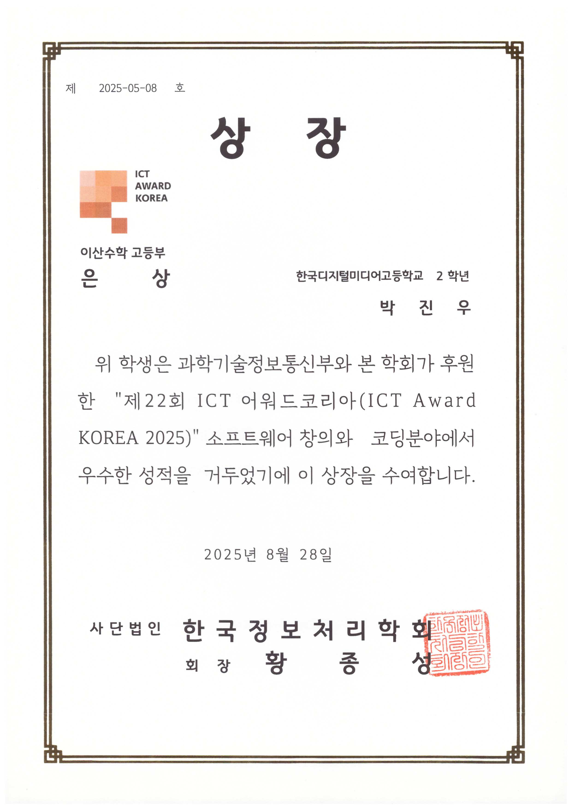

### ⑫ 2024 — Korea Olympiad in Informatics (KOI) Round 2, High School Division (Bronze, Chair of the Informatics Olympiad Committee)
- 41st KOI Round 2; problem solving with data structures and various algorithms, including time complexity optimization

$\color{#0969da}{\textsf{View evidence}}$

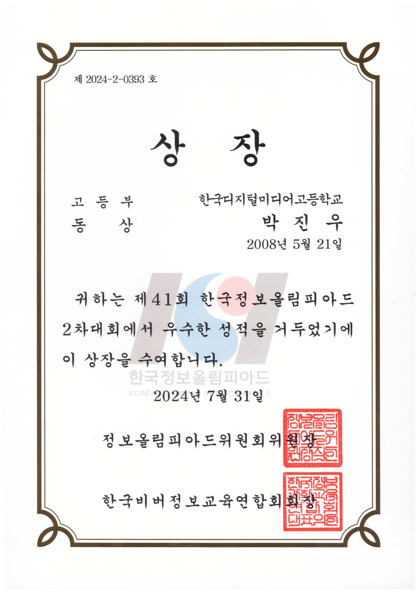

### ⑬ 2024 — Academic Excellence Award in Programming (Principal, Korea Digital Media High School)
- Academic Excellence Award in Programming, 2nd semester of the 2024 school year; outstanding achievement in programming courses, strengthening algorithm and coding skills

$\color{#0969da}{\textsf{View evidence}}$

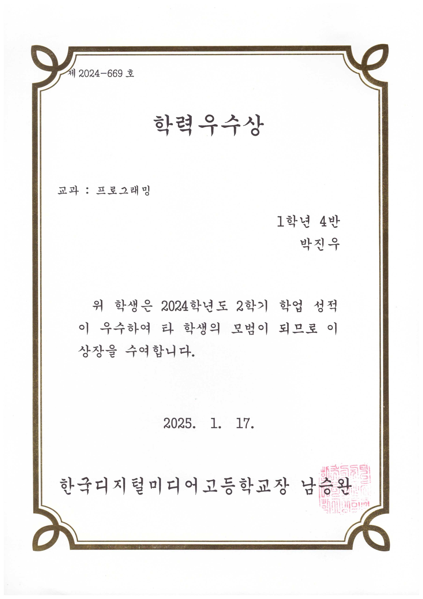

### ⑭ 2023 — Shinsegae-KAIST Science Olympiad (Excellence Award, 2nd Place, Daejeon Shinsegae Co., Ltd.)
- Shinsegae-KAIST Science Olympiad, Middle School Division, Excellence Award in robot coding; interdisciplinary thinking grounded in science and math, creative problem solving

$\color{#0969da}{\textsf{View evidence}}$

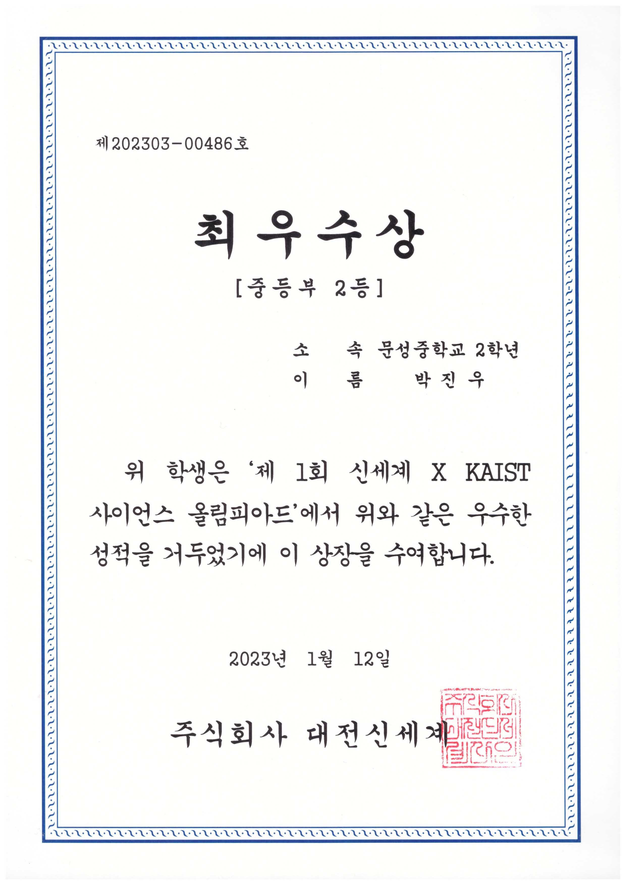

### ⑮ 2023 — School Creative Invention Inquiry Activity (Merit Award, Principal, Munseong Middle School)
- Took part in creative idea exploration and problem-solving activities, developing ideas from multiple perspectives

$\color{#0969da}{\textsf{View evidence}}$

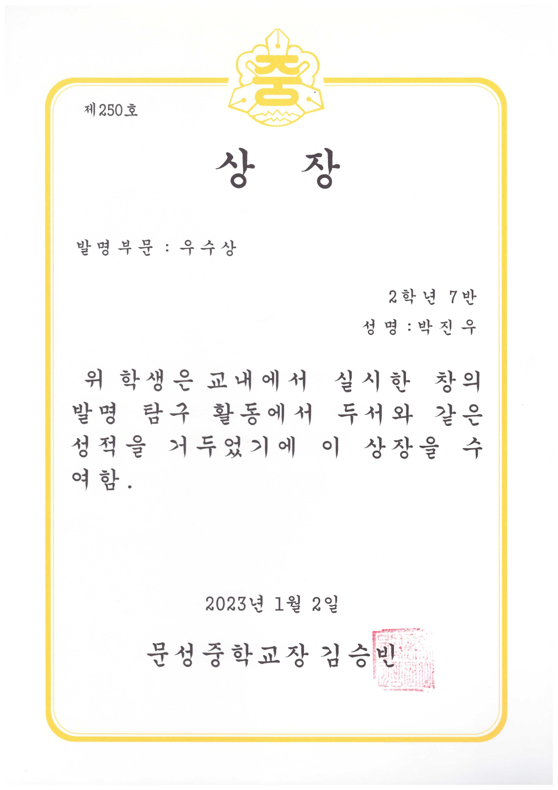

### ⑯ 2021 — School Creative Computing Competition (Grand Award, 1st Place, Principal, Seongnam Seo Middle School)
- Carried out a problem-solving project based on computational thinking, strengthening programming and logical reasoning, and implementing algorithms through creative approaches

$\color{#0969da}{\textsf{View evidence}}$

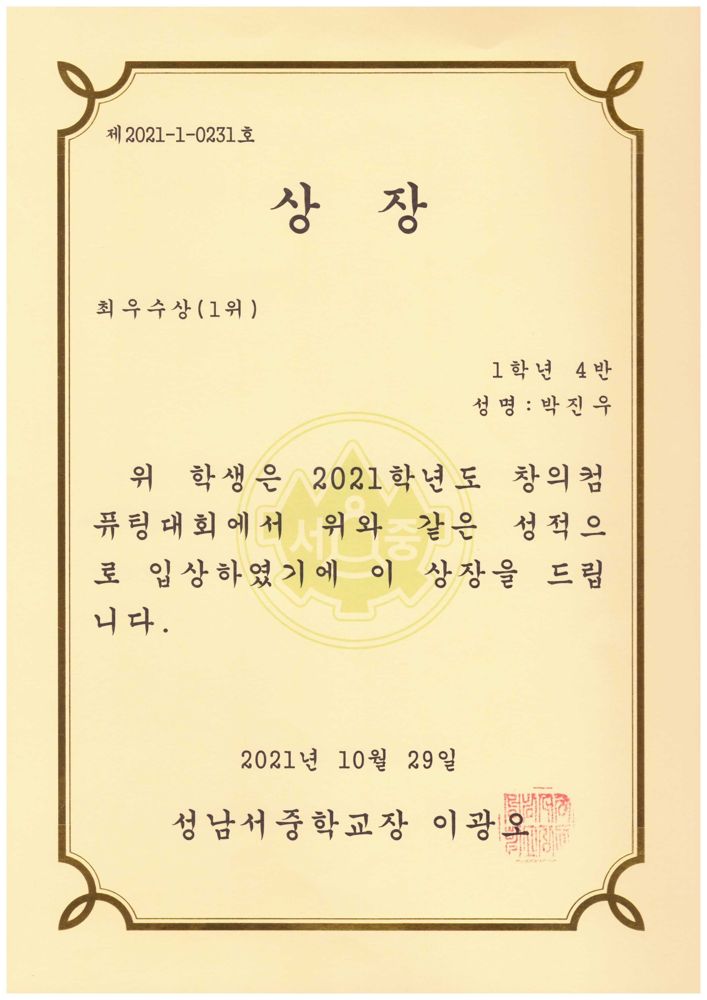

### ⑰ 2021 — Korea Mathematics Assessment (KMA) (Gold Award, Director of the Korea Mathematics Assessment Institute)
- Excellent mathematical thinking and problem-solving skills, strengthening logical and analytical abilities and math-based computing skills

$\color{#0969da}{\textsf{View evidence}}$

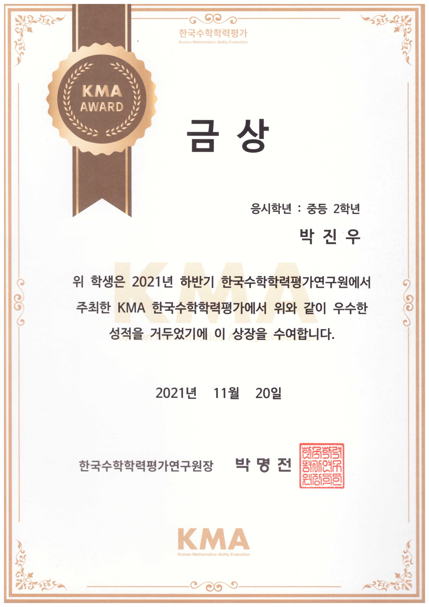

---

# 4. Related Learning

### ① 2026 — Korea AI Olympiad (KOAI) Summer School
- Completed the full program, Jul 11–26, 2026; advanced AI and machine learning theory and practice, building problem-solving skills for AI olympiads

$\color{#0969da}{\textsf{View evidence}}$

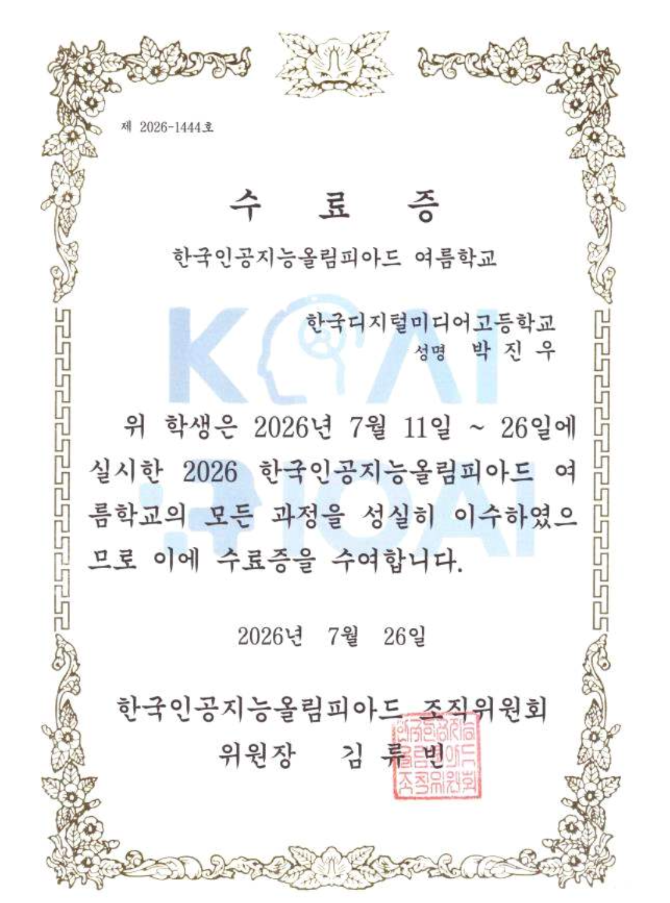

### ② 2026 — Google Machine Learning Crash Course (13 modules, including Neural Networks)
- Learned core machine learning concepts, model training, and working with data

$\color{#0969da}{\textsf{View evidence}}$

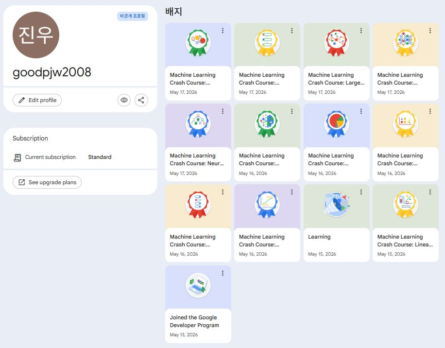

### ③ 2026 — Kaggle Learn Courses (14 courses, including Intermediate Machine Learning)
- Learned Python and data analysis, completed hands-on machine learning courses

$\color{#0969da}{\textsf{View evidence}}$

### ④ 2026 — International Olympiad in Informatics (IOI) Winter School
- Advanced algorithms and logical problem-solving training, efficient code implementation, competitive programming

$\color{#0969da}{\textsf{View evidence}}$

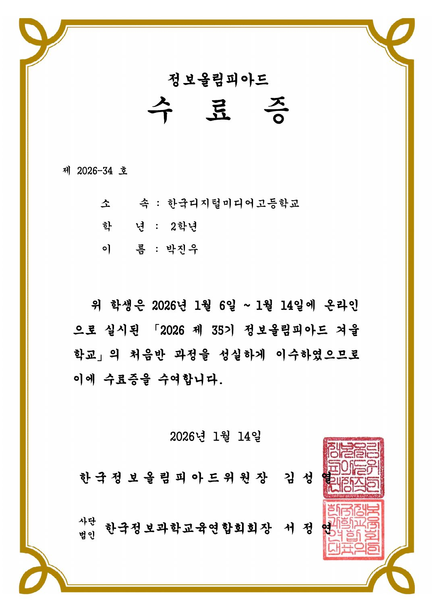

### ⑤ 2025 — International Olympiad in Informatics (IOI) Summer School
- Fundamentals of algorithms and problem solving, programming focused on data structures and implementation, building PS (problem solving) skills

$\color{#0969da}{\textsf{View evidence}}$

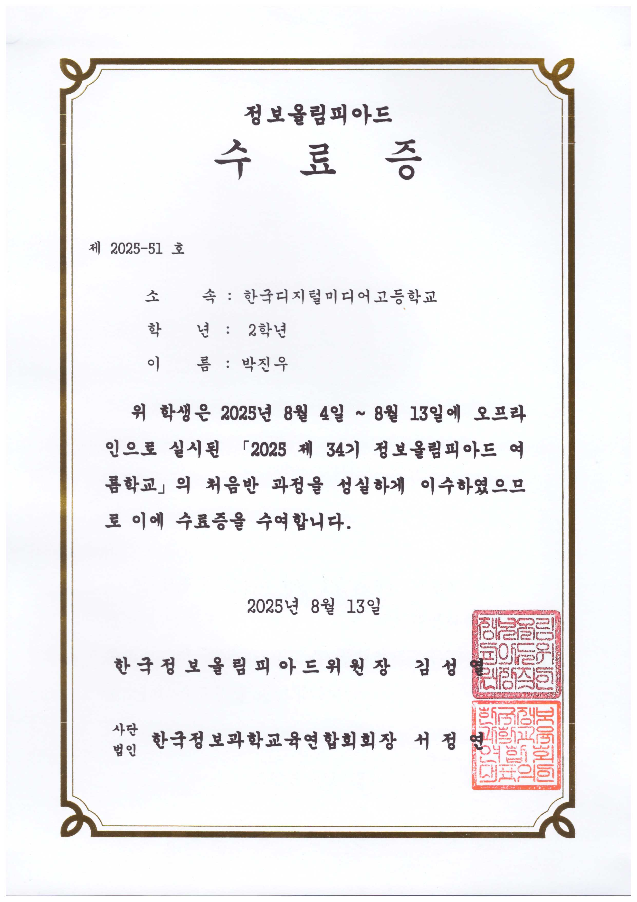

### ⑥ 2023 — KAIST Cyber Gifted Education, Data Science Course
- Grade A: 90 points (class average: 56); data analysis with Python and open data, basics of data preprocessing and visualization

$\color{#0969da}{\textsf{View evidence}}$

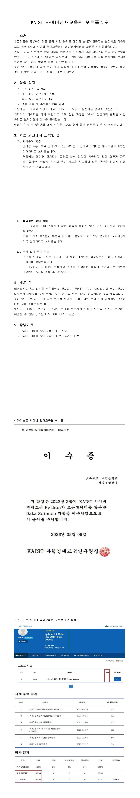

### ⑦ 2023 — AI Mini Class for Youth
- Learned basic AI concepts and use cases, explored AI-based problem solving and machine learning principles, data- and algorithm-centered thinking

$\color{#0969da}{\textsf{View evidence}}$

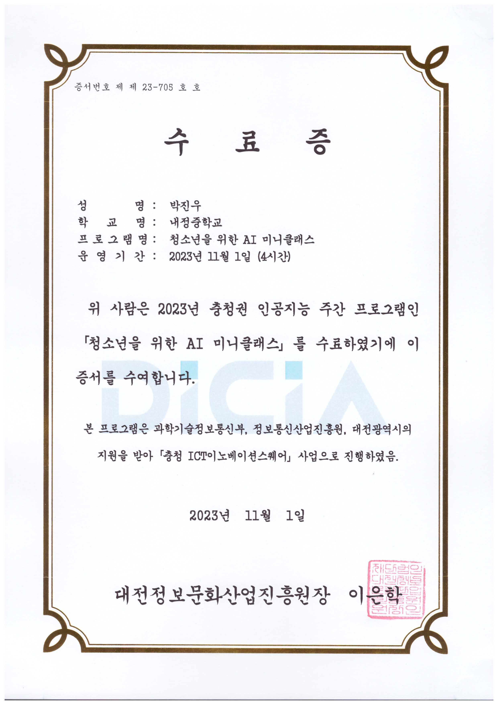

### ⑧ 2021 — Bebras Challenge (Computational and Algorithmic Thinking)
- Problem-solving activities based on computational thinking, algorithmic and logical analysis, exploring a variety of informatics problems

$\color{#0969da}{\textsf{View evidence}}$

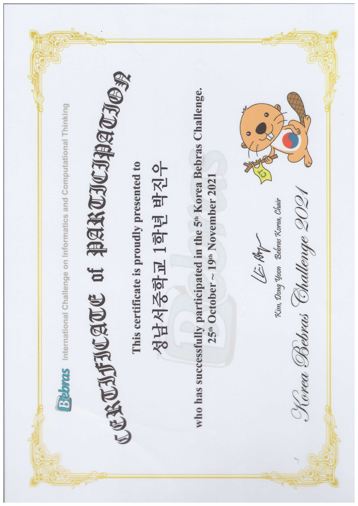

---

# 5. Other Informatics Skills

### ① 2022–2026 — Master tier on solved.ac, ranked 43rd in Korea (top 0.03%)
- Based on Solved.ac, Korea's algorithm skill rating platform

$\color{#0969da}{\textsf{View evidence}}$

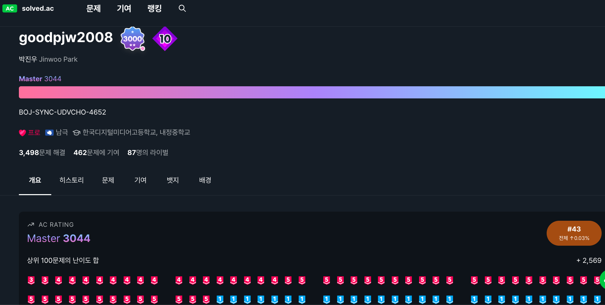
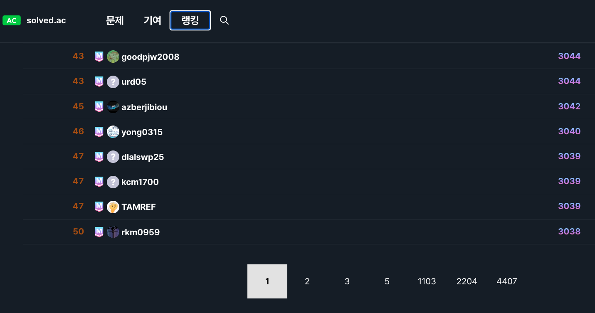

### ② 2022–2026 — Master rank on CODEFORCES, an international algorithm platform (global top 3%)
- Based on CODEFORCES, an algorithm contest platform for developers worldwide

$\color{#0969da}{\textsf{View evidence}}$

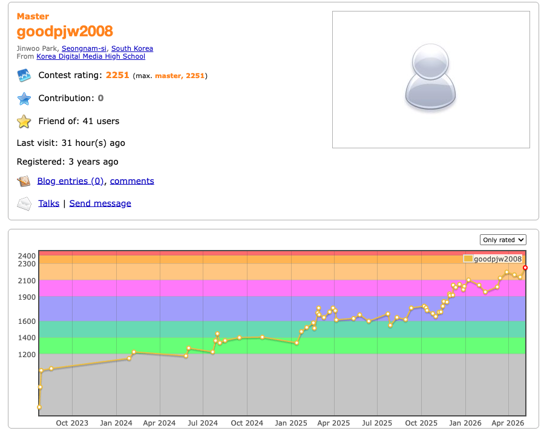

### ③ 2022–2026 — 1 Dan on AtCoder, a Japanese algorithm platform (global top 1.5%)
- Based on AtCoder, a Japan-based competitive programming platform

$\color{#0969da}{\textsf{View evidence}}$

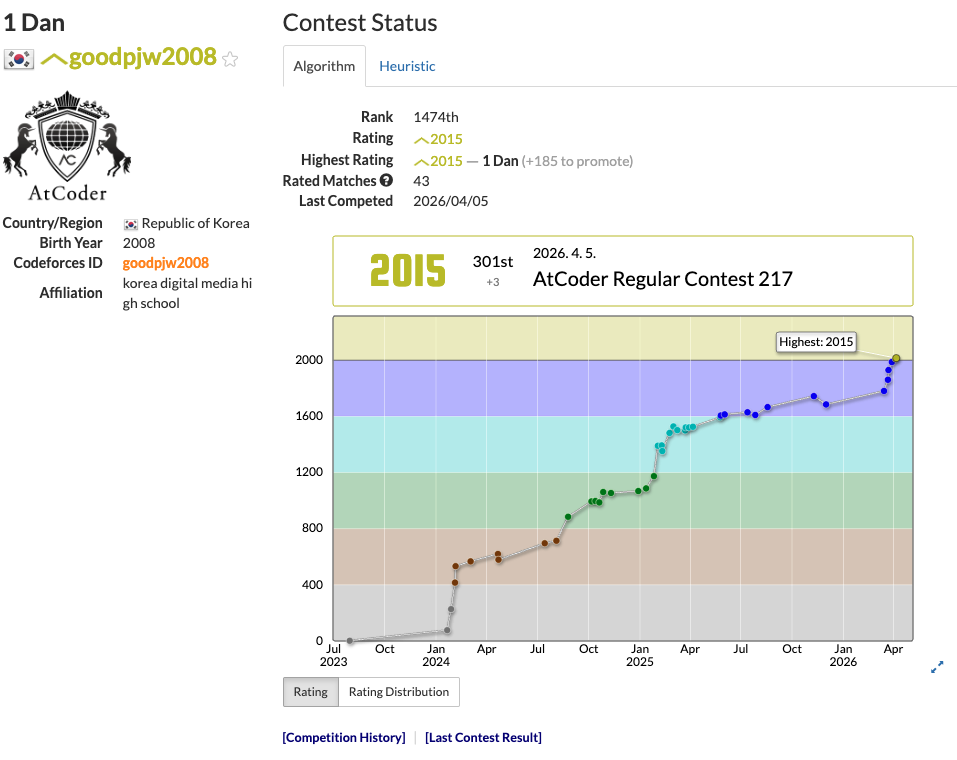

