# AI 활동 포트폴리오

**박진우(Jinwoo Park)** · 한국디지털미디어고등학교 제출용

---

# 1. 프로젝트

### ① 자원제약 환경용 PST·NNUE 하이브리드 체스 AI 설계 및 모델 개발
- **주요내용** — 평가함수 4종(PST, NN V1·V2, NNUE)과 탐색 알고리즘 2종(α-β·MCTS)을 조합·비교하여, CPU·오프라인 환경에서 동작하는 PST·NNUE 하이브리드 체스 AI를 설계 및 모델 구현
- **프로젝트보고서** — [자원제약_환경용_PST·NNUE_하이브리드_체스_AI_설계_및_모델_개발.pdf](./projects/자원제약_환경용_PST·NNUE_하이브리드_체스_AI_설계_및_모델_개발.pdf)
- **저장소** — [github.com/goodpjw2008/Project_AI-ChessBot-Hybrid](https://github.com/goodpjw2008/Project_AI-ChessBot-Hybrid) (Private)

### ② 체스에 관한 인공지능과 알고리즘 탐구(탐색 알고리즘 및 PST 모델 개선)
- **주요내용** — 체스 인공지능에 BFS·Minimax·α-β 가지치기 등 휴리스틱 알고리즘을 개선하고 PST 평가 모델을 개선하여 성능을 비교
- **프로젝트보고서** — [체스에_관한_인공지능과_알고리즘_탐구.pdf](./projects/체스에_관한_인공지능과_알고리즘_탐구.pdf)
- **저장소** — [github.com/goodpjw2008/Project_AI-ChessBot-PST](https://github.com/goodpjw2008/Project_AI-ChessBot-PST) (Private)

### ③ AI 봇 2종 구현 및 국제 플랫폼 최상위권 성적 달성
- **주요내용** — 글로벌 AI·코딩 Bot 경진 플랫폼 CodinGame에서 직접 설계한 AI 봇 2종으로 한국 1위, 글로벌 Top 0.2% 달성, AI 부문과 Coding Speed 부문에서 Legend 등급
- **프로젝트보고서** — [AI_봇_2종_구현_및_국제_플랫폼_최상위권_성적_달성.pdf](./projects/AI_봇_2종_구현_및_국제_플랫폼_최상위권_성적_달성.pdf)
- **저장소** — [github.com/goodpjw2008/Project_AI-Bots-CodinGame](https://github.com/goodpjw2008/Project_AI-Bots-CodinGame) (Private)

### ④ Kaggle(캐글) 대회 현재 참여 프로젝트 성적 (2026.5.23(토) 기준)
- [Orbit War](https://www.kaggle.com/competitions/orbit-wars) 187/3135 (상위 6.0%, 동메달)
  - 대회개요 : 우주 위성 자원 점령 AI 멀티에이전트 대결
  - 데이터학습 및 AI 기법 : Neural Network를 이용하여 우월 움직임 데이터를 분석하고 NN학습으로 사용하여 상위권 랭크

  

$\color{#0969da}{\textsf{증빙보기}}$

  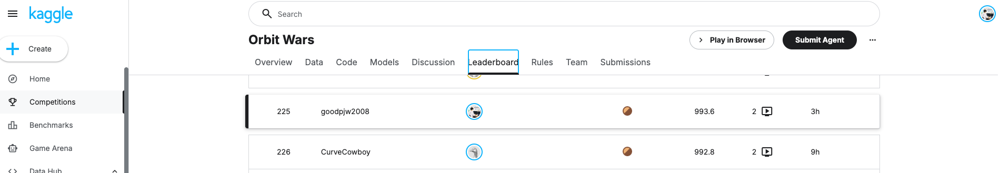

  

- [Connect X](https://www.kaggle.com/competitions/connectx) 5/405 (상위 1.2%)
  - 대회개요 : Connect Four 게임 AI 봇 대결
  - 데이터학습 및 AI 기법 : MCTS 기법 및 Neural Network를 사용하여 각 포지션의 유리함과 불림함 데이터 분석을 사용하여 상위권 랭크

  

$\color{#0969da}{\textsf{증빙보기}}$

  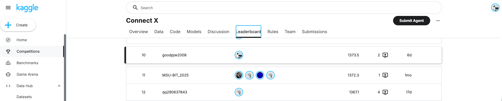

  

- [Predicting F1 Pit Stops](https://www.kaggle.com/competitions/playground-series-s6e5) 42/2026 (상위 2.1%)
  - 대회개요 : F1 그랑프리 피트스톱 횟수 예측 모델
  - 데이터학습 및 AI 기법 : CatBoost, LightGBM, 피처엔지니어링의 나의 결과와 상위권의 데이터 분석 결과 분석 블랜딩 기법으로 상위권 랭크

  

$\color{#0969da}{\textsf{증빙보기}}$

  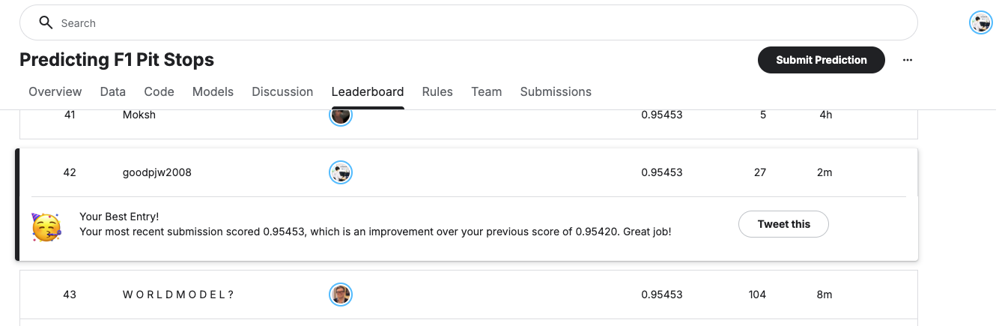

  

- [LLM Classification Finetuning](https://www.kaggle.com/competitions/llm-classification-finetuning) 35/282 (상위 12.4%)
  - 대회개요 : 두 LLM 응답 데이터를 PEFT 파인튜닝하여 인간 선호 예측
  - 데이터학습 및 AI 기법 : Gemma-2-9B 4-bit QLoRA 부분 PEFT 파인튜닝

  

$\color{#0969da}{\textsf{증빙보기}}$

  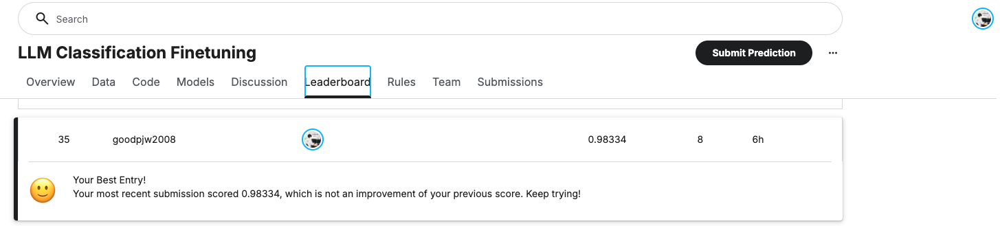

  

### ⑤ AI 코딩 선생님과 함께하는 온라인 코딩 학습 플랫폼 구현
- **주요내용** — 생성형 AI 코딩 선생님이 도와주는 중·고등학생용 온라인 저지(OJ) 학습 플랫폼 개발
- **프로젝트보고서** — [AI_코딩_선생님과_함께하는_온라인_코딩_학습_플랫폼_구현.pdf](./projects/AI_코딩_선생님과_함께하는_온라인_코딩_학습_플랫폼_구현.pdf)
- **저장소** — [github.com/goodpjw2008/Project_AI-DimiOJ](https://github.com/goodpjw2008/Project_AI-DimiOJ) (Private)

---

# 2. 수상이력

### ① 2026 — 아시아·태평양 정보올림피아드(APIO) (국내 7등, 정보올림피아드)
- 국내: 7등, 국제: 95등, Asia-Pacific Informatics Olympiad 아태지역 알고리즘 대회

$\color{#0969da}{\textsf{증빙보기}}$

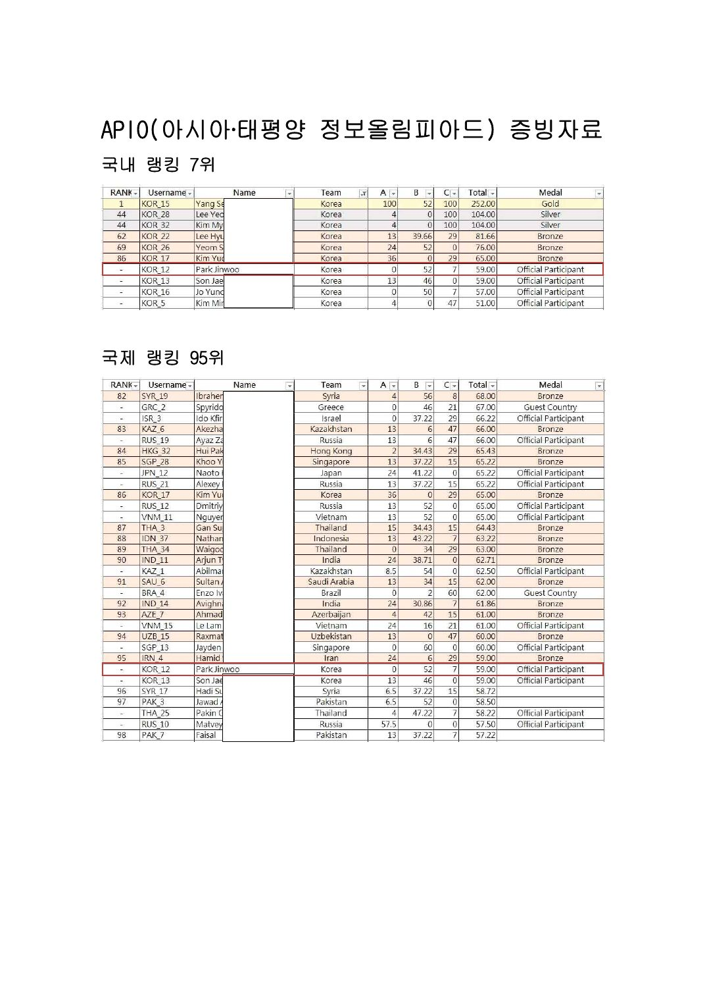

### ② 2026 — 청소년 IT 경시대회 알고리즘 고등부 금상(3등, 한국정보기술진흥원)
- 제6회 청소년 IT 경시대회 (알고리즘 고등부), 알고리즘 설계 및 구현 능력 평가

$\color{#0969da}{\textsf{증빙보기}}$

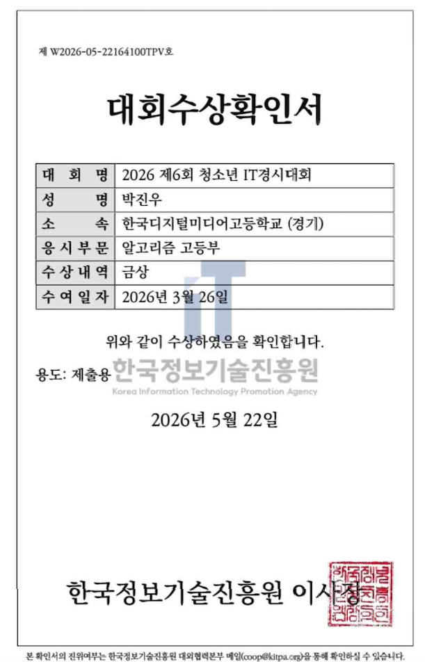

### ③ 2025 — K-EDU 창의력 경진대회 대상(1등, 과학기술정보통신부장관)
- AI·SW 기반 창의 문제 해결 프로젝트 수행, 아이디어 기획 및 구현 과정 참여, 컴퓨팅 사고력과 문제 해결

$\color{#0969da}{\textsf{증빙보기}}$

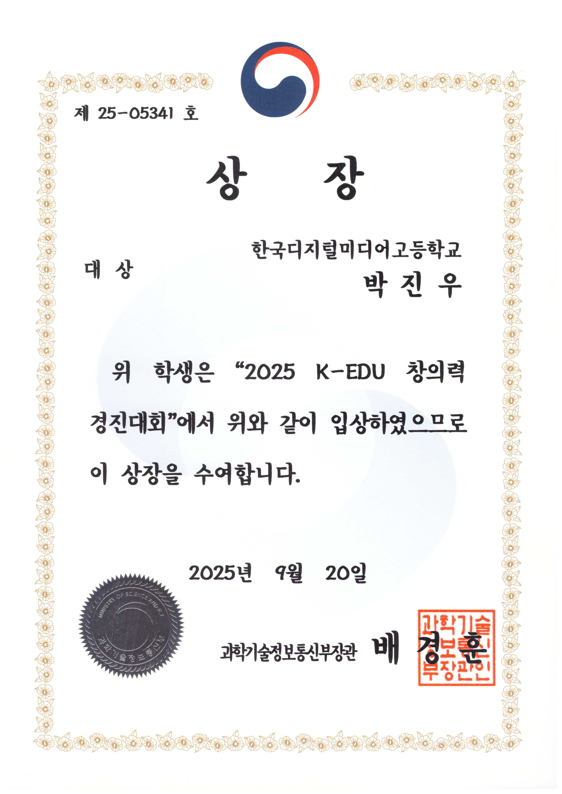

### ④ 2025 — 청소년 IT 경시대회 알고리즘 고등부 금상(3등, 한국정보기술진흥원)
- 제4회 청소년 IT 경시대회 (알고리즘 고등부), 알고리즘 설계 및 구현 능력 평가

$\color{#0969da}{\textsf{증빙보기}}$

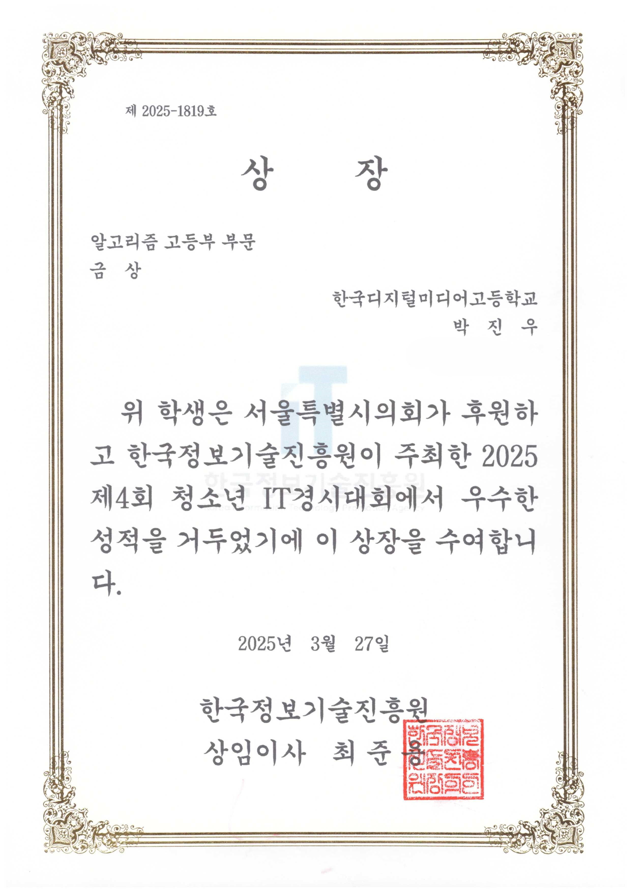

### ⑤ 2025 — 한국정보올림피아드(KOI) 2차 고등부 (은상, 정보올림피아드위원회위원장)
- 제42회 한국정보올림피아드(KOI) 2차, 자료구조와 다양한 알고리즘 기반 문제 해결 수행, 시간 복잡도 최적화 등

$\color{#0969da}{\textsf{증빙보기}}$

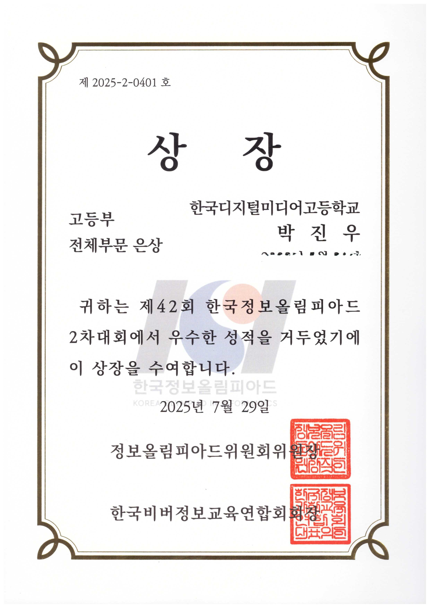

### ⑥ 2025 — ICT 어워드 코리아 이산수학 고등부 (은상, 3등, 한국정보처리학회회장)
- 제22회 ICT 어워드 코리아 (이산수학 고등부), 이산수학 및 논리적 사고 기반 문제 해결, 수학적 모델링과 컴퓨팅 사고력 활용, 알고리즘적 접근

$\color{#0969da}{\textsf{증빙보기}}$

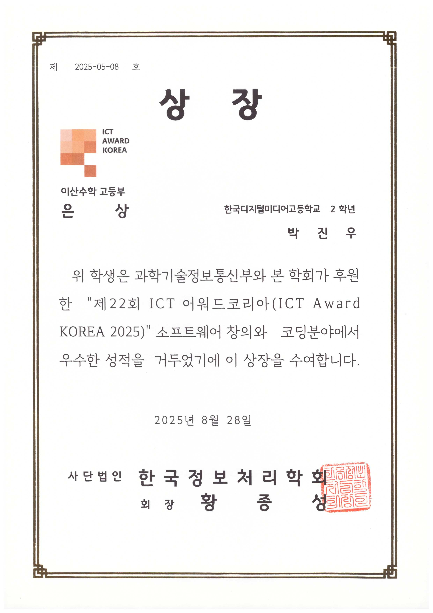

### ⑦ 2025 — 한국정보올림피아드(KOI) 2차 고등부 (동상, 정보올림피아드위원회위원장)
- 제42회 한국정보올림피아드(KOI) 2차, 자료구조와 다양한 알고리즘 기반 문제 해결 수행, 시간 복잡도 최적화 등

$\color{#0969da}{\textsf{증빙보기}}$

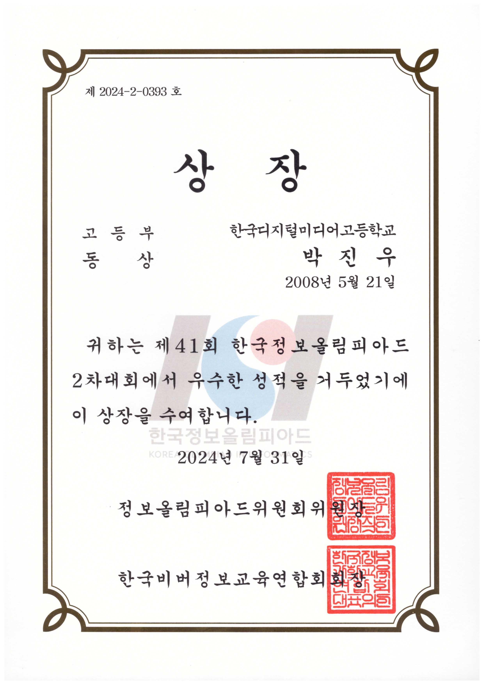

### ⑧ 2024 — 프로그래밍 학력우수상 (한국디지털미디어고등학교장)
- 2024학년도 2학기 프로그래밍 학력우수상, 프로그래밍 과목 우수 성취, 알고리즘 및 코딩 역량 강화

$\color{#0969da}{\textsf{증빙보기}}$

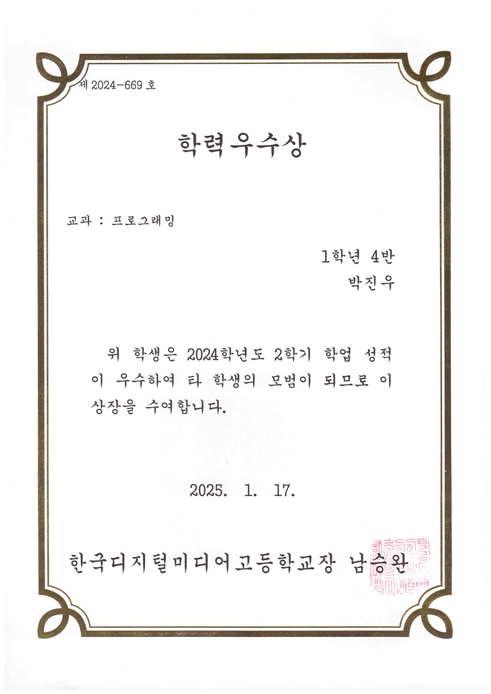

### ⑨ 2023 — 신세계-KAIST 사이언스 올림피아드 (최우수상, 2등, 주식회사 대전신세계)
- 신세계-KAIST 사이언스 올림피아드 중등부 최우수상, 로봇 코딩분야, 과학·수학 기반 융합 사고력, 창의적 문제 해결 경험

$\color{#0969da}{\textsf{증빙보기}}$

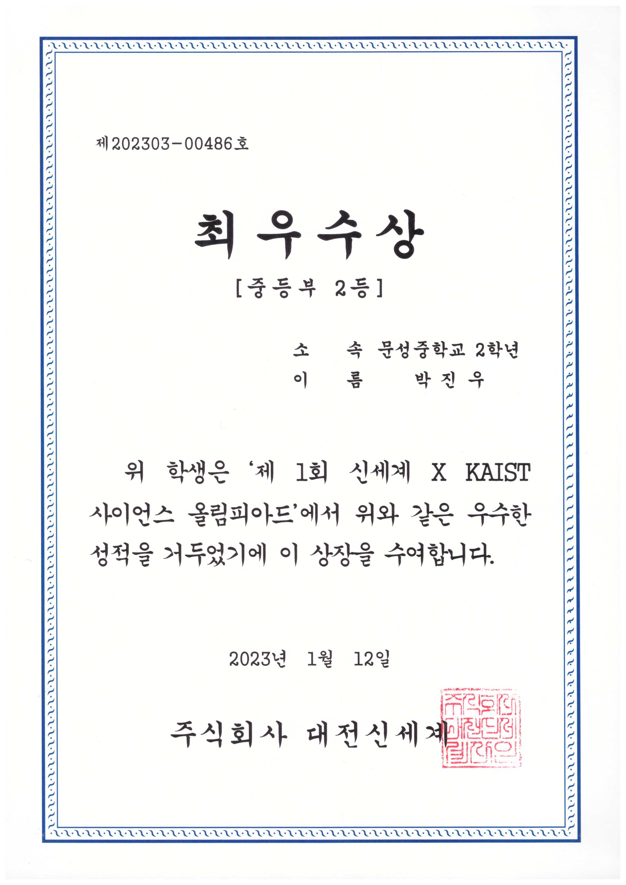

### ⑩ 2023 — 교내 창의발명탐구활동 (우수상, 문성중학교장)
- 창의적 아이디어 탐구 및 문제 해결 활동 참여, 다양한 관점에서 아이디어를 구체화하는 경험 수행

$\color{#0969da}{\textsf{증빙보기}}$

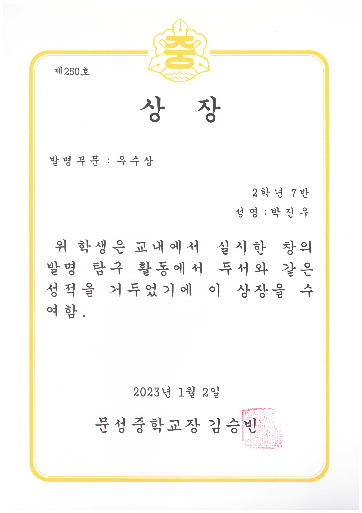

### ⑪ 2021 — 교내 창의컴퓨팅대회 (최우수상, 1등, 성남서중학교장)
- 컴퓨팅 사고력 기반 문제 해결 프로젝트 수행, 프로그래밍 및 논리적 사고 능력 강화, 창의적 접근을 통한 알고리즘 구현 역량

$\color{#0969da}{\textsf{증빙보기}}$

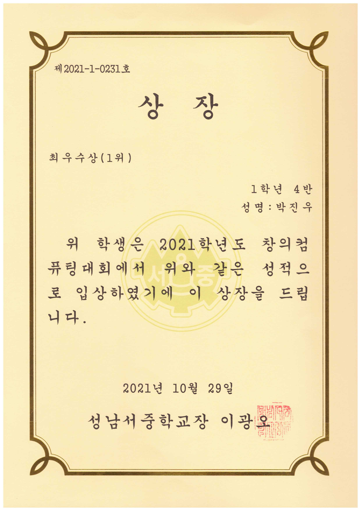

### ⑫ 2021 — 한국수학학력평가연구원(KMA) (금상, 한국수학학력평가원장)
- 수학적 사고력 및 문제 해결 능력 우수, 논리적 접근과 분석 능력 강화, 수학 기반 컴퓨팅 역량 향상

$\color{#0969da}{\textsf{증빙보기}}$

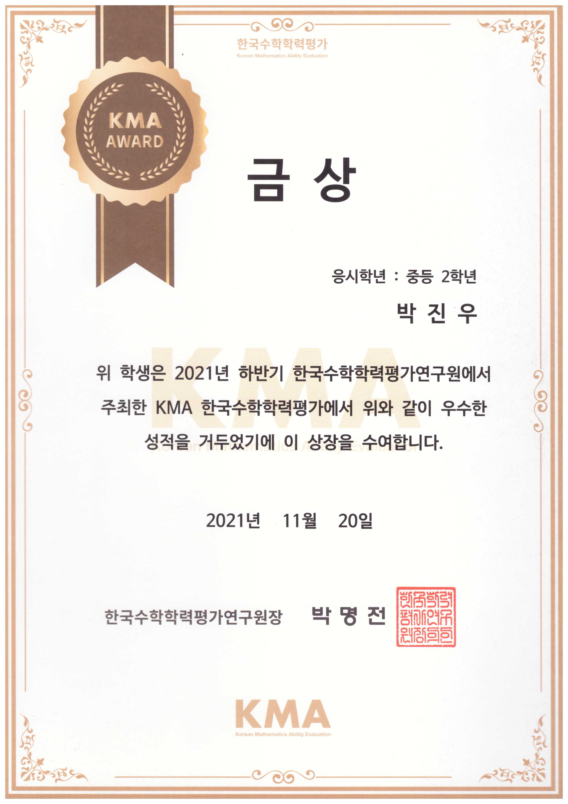

---

# 3. 관련 학습이력

### ① 2026 — 구글 머신러닝 단기집중과정 (Neural networks 등 13개 코스)
- 머신러닝 핵심 개념 학습, 모델 학습 및 데이터 활용 이해

$\color{#0969da}{\textsf{증빙보기}}$

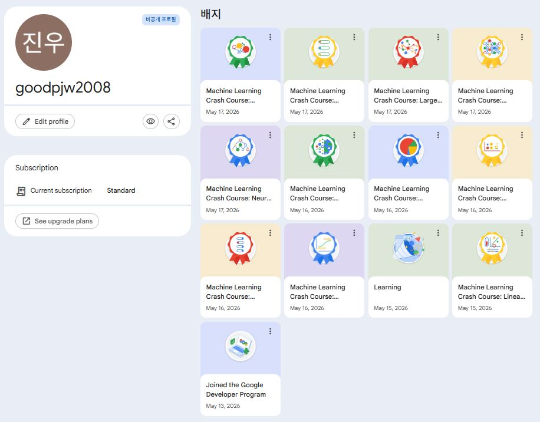

### ② 2026 — Kaggle Learn 교육과정 (Intermediate Machine Learning 등 14개 코스)
- Python 및 데이터 분석 학습, 머신러닝 실습 과정 수행

$\color{#0969da}{\textsf{증빙보기}}$

### ③ 2026 — KAIST 사이버영재교육 데이터사이언스 과정
- A등급: 90점 / 학급 평균: 56점, Python과 오픈데이터를 활용한 데이터 분석 학습, 데이터 전처리 및 시각화 기초 경험

$\color{#0969da}{\textsf{증빙보기}}$

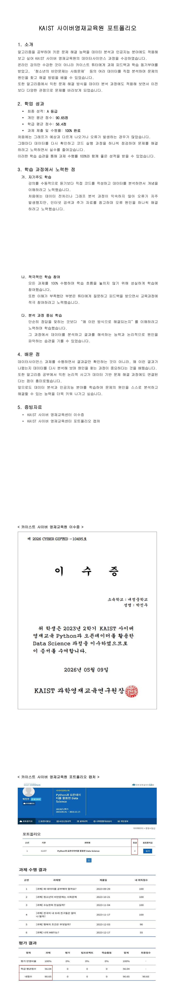

### ④ 2026 — 국제정보올림피아드(IOI) 겨울학교
- 심화 알고리즘 및 논리적 문제 해결 훈련, 효율적인 코드 구현 및 사고력 강화, 경쟁 프로그래밍 기반 학습 경험

$\color{#0969da}{\textsf{증빙보기}}$

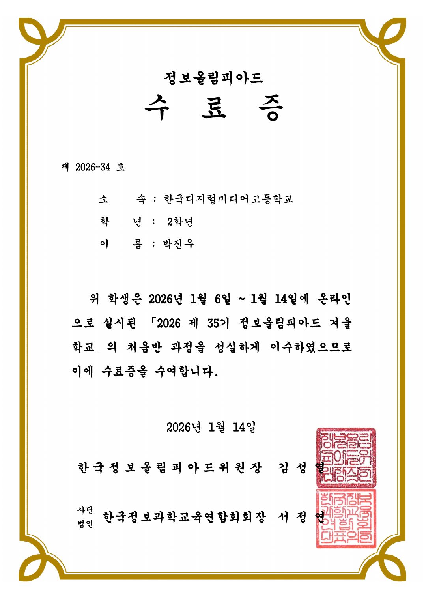

### ⑤ 2025 — 국제정보올림피아드(IOI) 여름학교
- 알고리즘 및 문제 해결 기초 학습, 자료구조와 구현 중심 프로그래밍 경험, PS(Problem Solving) 역량 강화

$\color{#0969da}{\textsf{증빙보기}}$

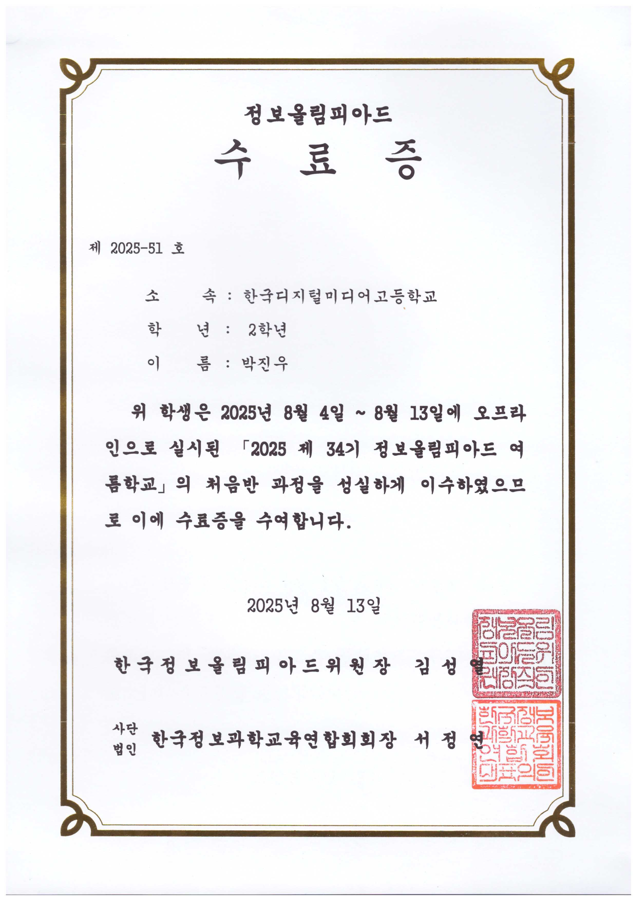

### ⑥ 2023 — 청소년을 위한 AI 미니클래스
- 인공지능 기초 개념 및 활용 사례 학습, AI 기반 문제 해결 과정과 머신러닝 원리 탐구, 데이터와 알고리즘 중심 사고 경험

$\color{#0969da}{\textsf{증빙보기}}$

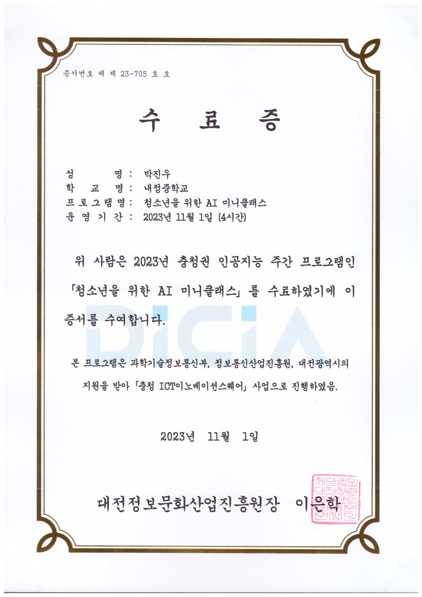

### ⑦ 2021 — 비버챌린지(컴퓨팅 및 알고리즘 사고 향상교육)
- 컴퓨팅 사고력 기반 문제 해결 활동 참여, 알고리즘적 사고와 논리적 분석 경험, 다양한 유형의 정보과학 문제 탐구

$\color{#0969da}{\textsf{증빙보기}}$

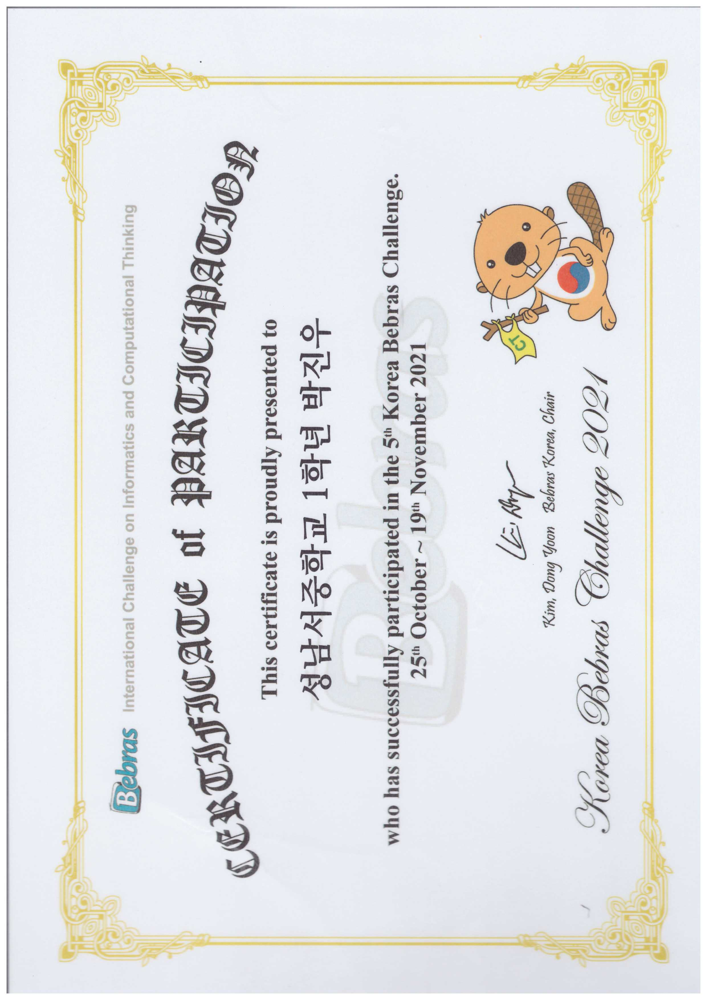

---

# 4. 기타 정보과학 관련 역량

### ① 2022~2026 — 국내 알고리즘 문제 해결 역량 Master 등급 43위 (상위 0.03%)
- 국내 알고리즘 실력 분석 플랫폼인 Solved.ac 기준

$\color{#0969da}{\textsf{증빙보기}}$

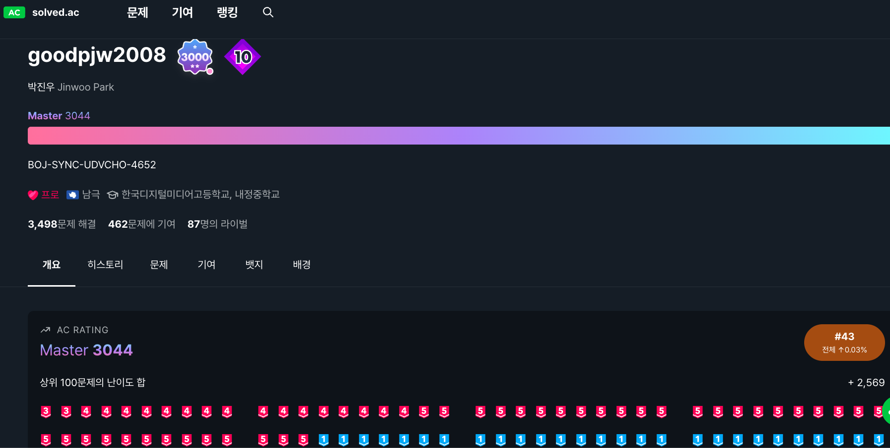
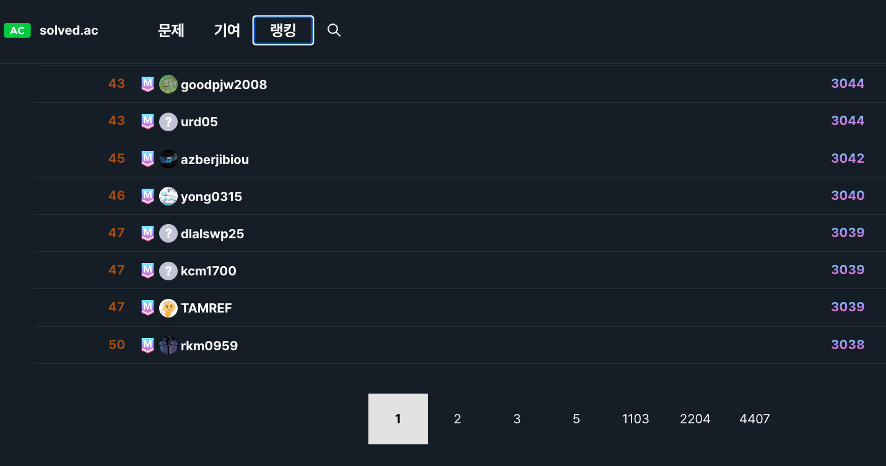

### ② 2022~2026 — 알고리즘 해결 국제 플랫폼 CODEFORCES Master 등급 (전세계 상위 3%)
- 전 세계 개발자 대상 알고리즘 대회 플랫폼 CODEFORCES 기준

$\color{#0969da}{\textsf{증빙보기}}$

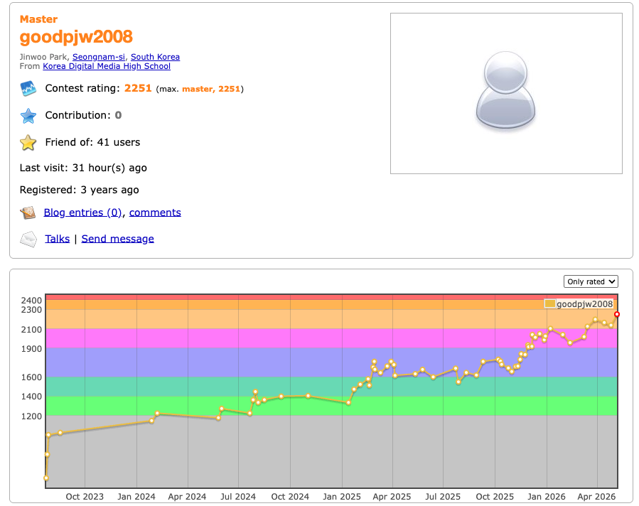

### ③ 2022~2026 — 알고리즘 해결 일본 플랫폼 AtCoder 1Dan (전세계 상위 1.5%)
- 일본 기반의 알고리즘 프로그래밍 대회 플랫폼 기준

$\color{#0969da}{\textsf{증빙보기}}$

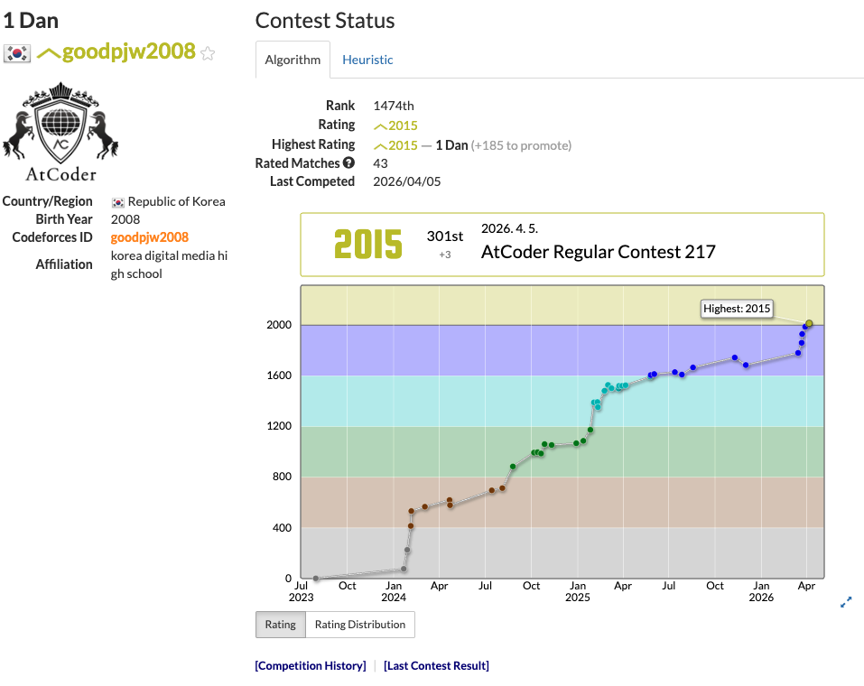

